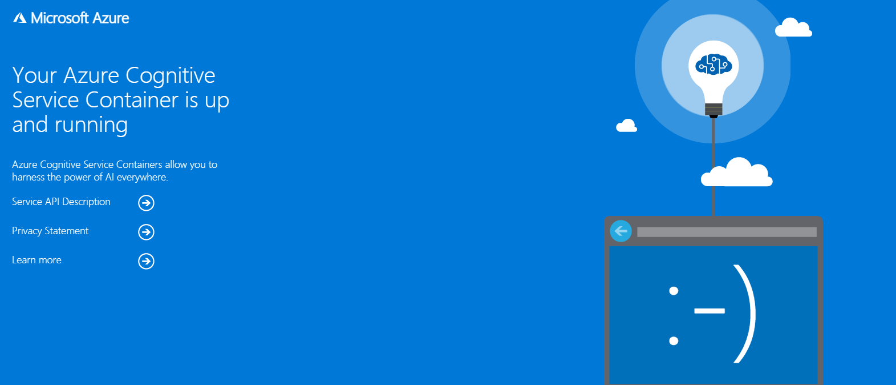

# aks-with-rabbitmq


## First things first

Follow [this](https://docs.microsoft.com/en-us/azure/cognitive-services/computer-vision/deploy-computer-vision-on-premises#deploy-multiple-v3-containers-on-the-kubernetes-cluster) tutorial's sections of:

```
Prerequisites
Gathering required parameters
```

For example purposes, I called the computer vision resoruce `aks-with-rabbitmq-cv`

## Setup the AKS cluster

1. Create a resource group (e.g. aks-with-rabbitmq-rg)
2. Create a Kubernetes Service (e.g. aks-with-rabbitmq-cluster) [I used all default settings]
3. Connect with the AKS cluster with this command:
```az aks get-credentials --resource-group MyResourceGroup --name MyCluster```
For example:
``` az aks get-credentials --resource-group aks-with-rabbitmq-rg --name aks-with-rabbitmq-cluster ```


To check, run `kubectl get all`, output should be:

``` NAME                 TYPE        CLUSTER-IP   EXTERNAL-IP   PORT(S)   AGE```
``` service/kubernetes   ClusterIP   10.0.0.1     <none>        443/TCP   57m ```

## Create RabbitMQ Pod

1. Run `helm repo add azure-marketplace https://marketplace.azurecr.io/helm/v1/repo`
2. Run `helm install azure-marketplace/rabbitmq --generate-name`

Output should be similar to:
```
NAME: rabbitmq-1629212308
LAST DEPLOYED: Tue Aug 17 10:58:33 2021
NAMESPACE: default
STATUS: deployed
REVISION: 1
TEST SUITE: None
NOTES:
** Please be patient while the chart is being deployed **

Credentials:
    echo "Username      : user"
    echo "Password      : $(kubectl get secret --namespace default rabbitmq-1629212308 -o jsonpath="{.data.rabbitmq-password}" | base64 --decode)"
    echo "ErLang Cookie : $(kubectl get secret --namespace default rabbitmq-1629212308 -o jsonpath="{.data.rabbitmq-erlang-cookie}" | base64 --decode)"

Note that the credentials are saved in persistent volume claims and will not be changed upon upgrade or reinstallation unless the persistent volume claim has been deleted. If this is not the first installation of this chart, the credentials may not be valid.
This is applicable when no passwords are set and therefore the random password is autogenerated. In case of using a fixed password, you should specify it when upgrading.
More information about the credentials may be found at https://docs.bitnami.com/general/how-to/troubleshoot-helm-chart-issues/#credential-errors-while-upgrading-chart-releases.

RabbitMQ can be accessed within the cluster on port  at rabbitmq-1629212308.default.svc.

To access for outside the cluster, perform the following steps:

To Access the RabbitMQ AMQP port:

    echo "URL : amqp://127.0.0.1:5672/"
    kubectl port-forward --namespace default svc/rabbitmq-1629212308 5672:5672

To Access the RabbitMQ Management interface:

    echo "URL : http://127.0.0.1:15672/"
    kubectl port-forward --namespace default svc/rabbitmq-1629212308 15672:15672
```


Running `kubectl get pods` should result in:
`rabbitmq-1629212308-0   1/1     Running   0          5m6s`


For the RabbitMQ UI management portal run:
`kubectl port-forward --namespace default svc/NAME 15672:15672`

## Prepare deployment.yaml

In `deployment.yaml`:
1. Fill in the endpoint and api key under `billing` and `apikey`
2. Fill `Queue__RabbitMQ__HostName` with `NAME.default.svc` from the RabbitMQ pod generation output
3. Fill `Queue__RabbitMQ__VirtualHost` with the deafult `/`
4. Fill `Queue__RabbitMQ__Username` and `Queue__RabbitMQ__Password` with the ouput of the running the commands from the RabbitMQ pod generation output

Username is probably `user` and password is a random 10 character string. 

5. Fill `Queue__RabbitMQ__Port` with the default `5672`
6. Set `replicas` to `3` or any number you want. 


## Deploy

Run `kubectl apply -f deployment.yaml`

If you run, `kubectl get pods`, you should see 4 (replicas+1) pods.


If you run, `kubectl get services`, under `EXTERNAL-IP` for TYPE `LoadBalancer` will be `PENDING`.
Wait for a few minutes and check again, an actualy IP,`XX.XXX.XX.255` should be there.

## Test

To test it worked, in your browser run `EXTERNAL-IP:5000`.

You should get the following output: 



## Test with Python

In `test.py`, update the `external_ip` variable with your EXTERNAL_IP

Run `python test.py`. 

The output should be an array of the following object:

```
{
    "boundingBox": [
        2.3211,
        8.9176,
        2.458,
        8.9176,
        2.458,
        8.9944,
        2.3211,
        8.9944
    ],
    "confidence": 1,
    "text": "as"
}
```